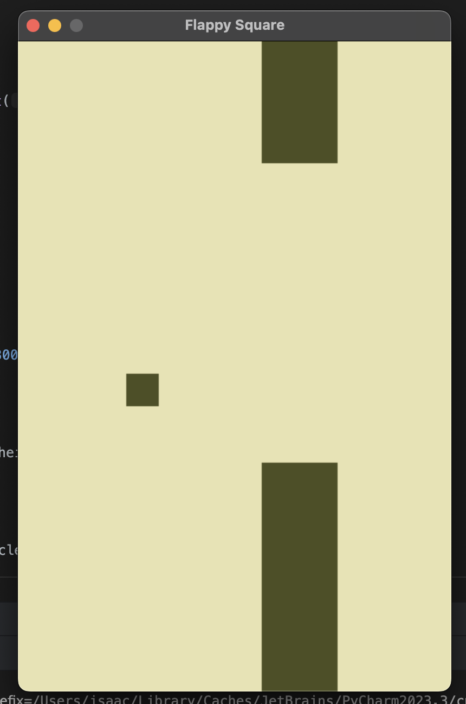

# Flappy Block

## Description

Flappy Block is a simple example of a game written in PyGame. It's simply a square that can navigated through rectangular obstacles.



## Installation

To install the game, simply clone the repository and run the main.py file.

This project is using [Poetry](https://python-poetry.org/docs/#installation) for dependency management. If you don't have Poetry installed, you can install it with the following command:
```bash
curl -sSL https://install.python-poetry.org | python3 -
```

```bash
git clone https://github.com/parrotmac/flappyblock.git
cd flappyblock
poetry install
poetry run python main.py
```

## License

This project is licensed under the MIT License - see the [LICENSE](LICENSE) file for details.
